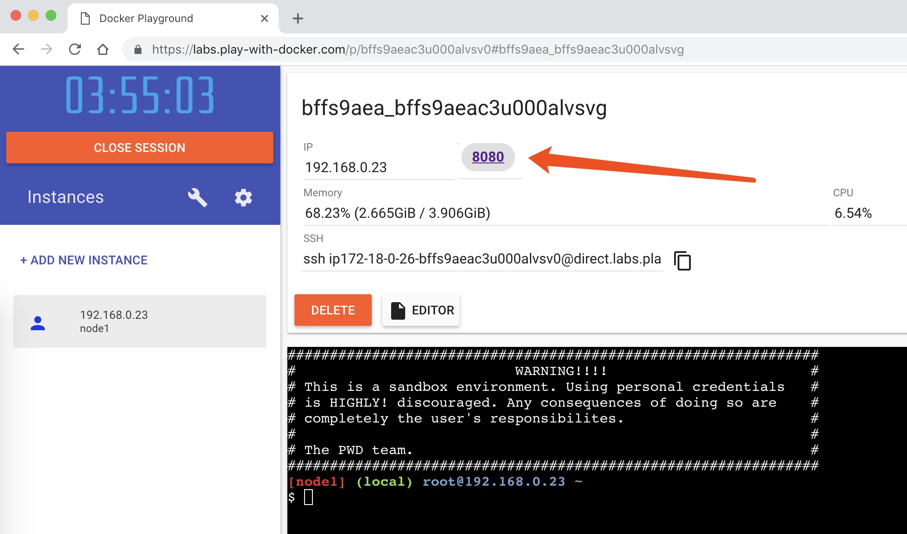
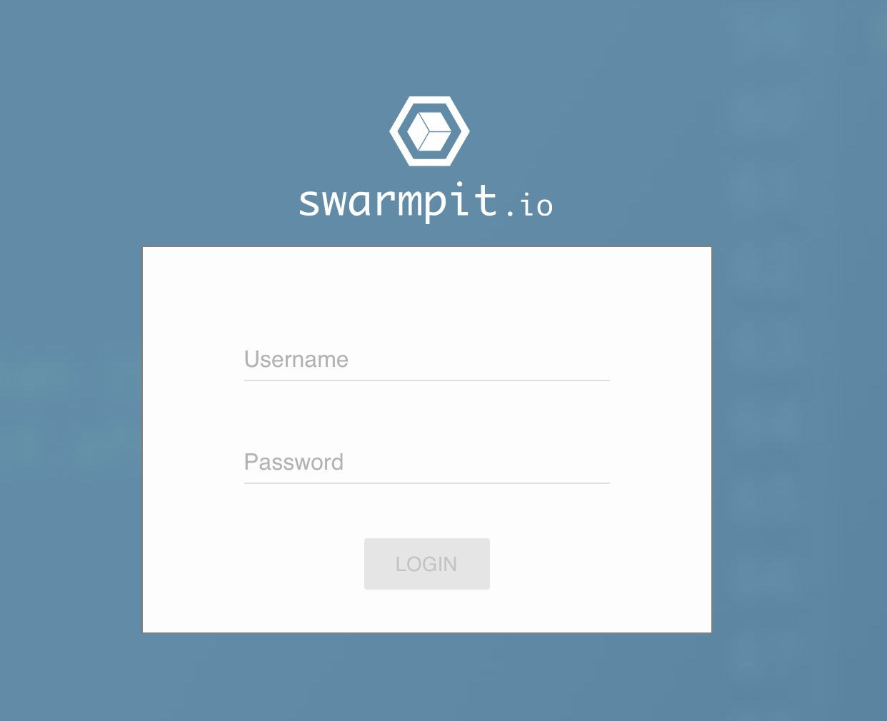
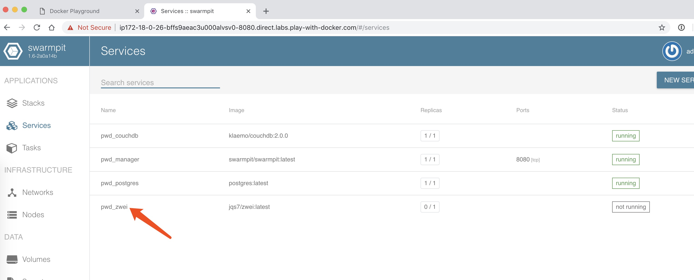
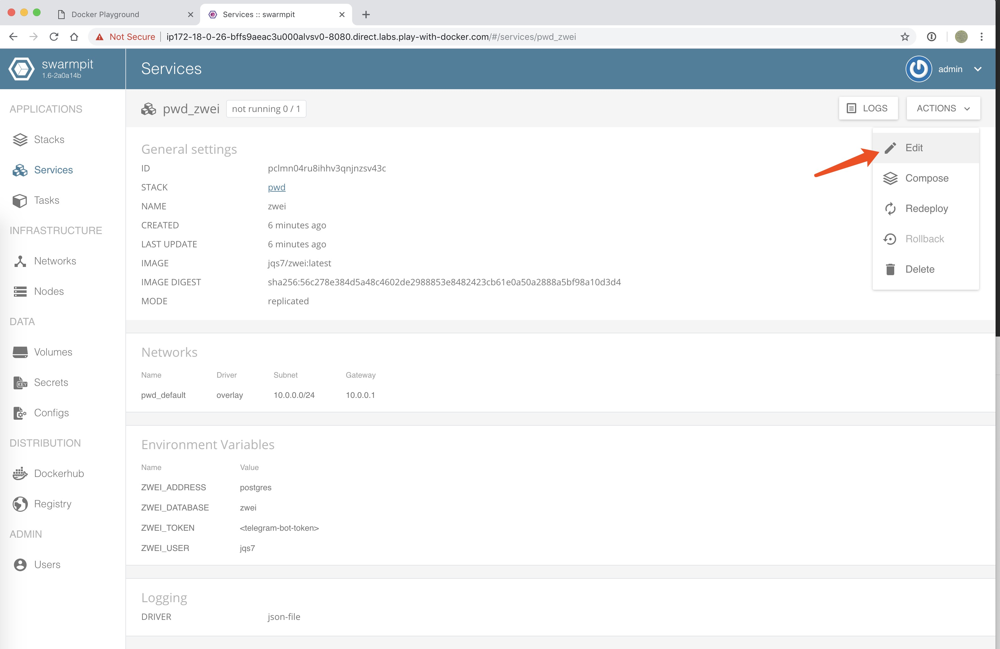
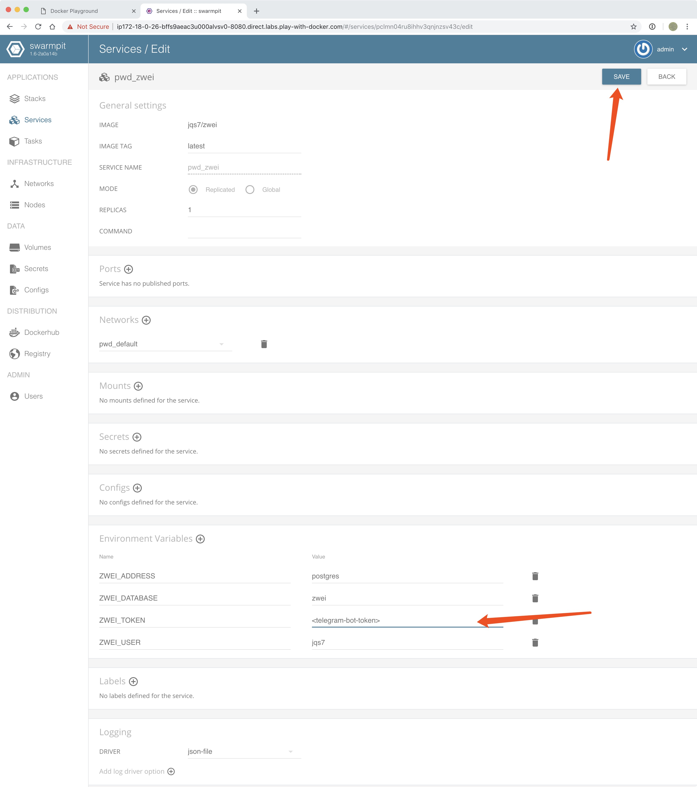

# Telgram 验证机器人


### Play With Docker

1. **部署环境, 点击`Try in PWD`按钮**

[](https://labs.play-with-docker.com/?stack=https://raw.githubusercontent.com/llitfkitfk/zwei/master/stack.yml)
2. **配置好之后, 打开Docker Swarm管理界面**

3. **登录Docker Swarm管理界面**

4. **选择验证机器人Docker Swarm服务 -- pwd_zwei**

5. **编辑验证机器人服务**

6. **修改验证服务中的环境变量`ZWEI_TOKEN`为你的Telegram bot token, 并保存**



### Quick Start for development

```bash
# postgres数据库安装需要先安装 docker for mac/win
make all 
```
